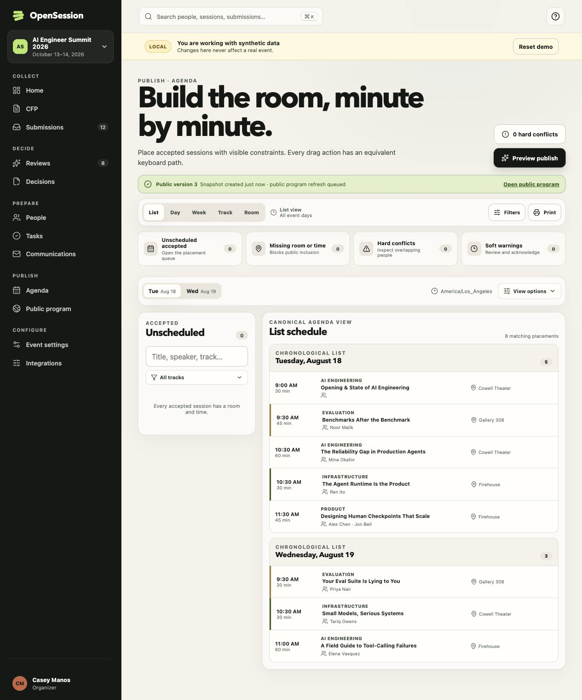
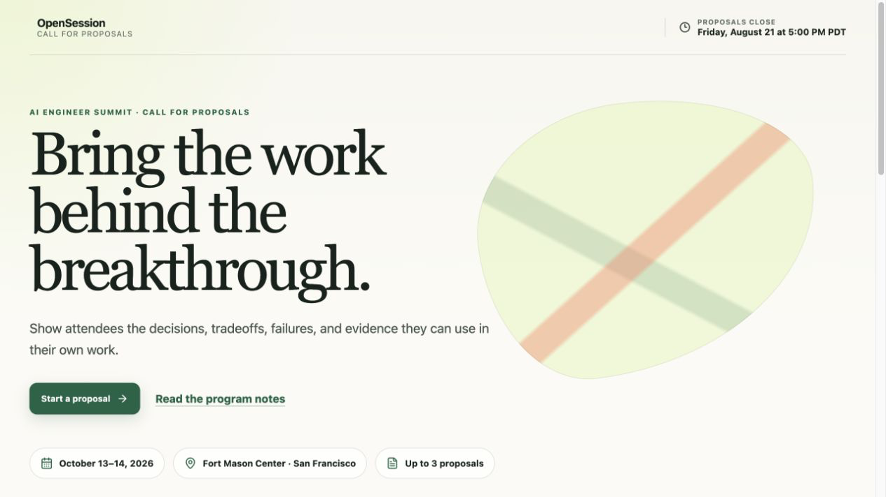

# OpenSession

OpenSession is an open-source conference program operating system: collect proposals, run structured reviews, make decisions, prepare speakers, build a conflict-free agenda, and publish the program from one workspace.

[Live demo](https://opensessionboard.com/) · [API documentation](https://opensessionboard.com/docs/api) · [OpenAPI 3.1](https://opensessionboard.com/openapi.json) · [Source](https://github.com/caseymanos/opensession) · [MIT license](./LICENSE)

> **Release status — August 11, 2026:** the public release candidate is online and the source remains active competition work. The 2026 Kill My SaaS submission deadline is **August 12 at 10:00 PM America/Los_Angeles** (`2026-08-13T05:00:00Z`). Availability is not a claim that every optional integration is enabled; production email, writes, and external providers remain behind explicit release gates.

## Product tour

These screenshots were captured from the current deterministic local product surfaces at this revision. They contain synthetic fixture data and are product references, not production or judge evidence.

### Program operations



### Public call for proposals



The release candidate includes the central program workflow: a versioned CFP, tenant-scoped submission and review operations, auditable decisions, speaker profiles and tasks, scheduled communications, an accessible agenda builder, published schedules and speakers, and a scoped read API with one guarded submission mutation. Accelevents export and live outbound delivery remain externally gated and are never represented by fixtures as live provider proof.

## Architecture

The application ships as one Cloudflare Worker with React static assets and a Hono HTTP boundary. Airtable is the authoritative event-program store. D1 owns authentication, operations, audit, idempotency, repair state, and read projections. R2 stores private files. Durable Objects serialize the Airtable base and each event agenda; Queues and a task-reminder Workflow own reliable asynchronous work.

```text
apps/web/                 React application and route modules
workers/app/              Worker, API, Durable Objects, Workflow, queue consumers
packages/domain/          Entities, policies, conflict and readiness logic
packages/contracts/       Zod contracts and public API schemas
packages/data/            Airtable authority and D1 projection boundaries
packages/email/           Templates, merge engine and calendar attachments
packages/integrations/    Provider adapters and deterministic fixtures
packages/ui/              Accessible components and design tokens
migrations/               Forward-only D1 migrations
tests/e2e/                Playwright product and release paths
```

Read [the architecture decision record](./docs/04-architecture.md), [data ownership map](./docs/05-data-model.md), and [open-source operator guide](./docs/19-open-source-operator-guide.md) before changing a persistence or provider boundary.

## Quick start

Prerequisites are Node.js `26.7.0` from [`.nvmrc`](./.nvmrc) and pnpm `10.34.5` from the root `packageManager` field.

```bash
git clone https://github.com/caseymanos/opensession.git
cd opensession
nvm use
corepack enable
pnpm install --frozen-lockfile
pnpm dev
```

Open `http://localhost:8787`. The shell, deterministic UI fixtures, health endpoints, generated OpenAPI, and API docs run without provider secrets. Copy [`.env.example`](./.env.example) to `.dev.vars` only for a feature that needs local configuration; never fill placeholders in committed files.

Useful local routes:

- `/` — organizer workspace with synthetic data
- `/fixtures/agenda/published?view=list` — deterministic published-agenda surface
- `/fixtures/public-cfp/interactive` — deterministic public CFP surface
- `/health/live` and `/health/ready` — runtime and binding readiness
- `/openapi.json` and `/docs/api` — generated API contract and human docs

Use `pnpm dev:web` for UI-only Vite work on port `5173`. For reproducible local D1 state, migration order, remote provisioning, Airtable schema bootstrap, guarded demo seed, email modes, rollback, and dual-store recovery, follow [the operator guide](./docs/19-open-source-operator-guide.md).

## Public API

The generated OpenAPI 3.1 document is built from the same runtime schema catalog that registers the handlers. The current v1 surface contains 13 paths for events, submissions, sessions, speakers, tasks, the published schedule, and export-run reads; submission lifecycle is the only public API mutation.

```bash
curl --fail --silent http://localhost:8787/openapi.json \
  | jq -e '.openapi == "3.1.0" and (.paths | length == 13)'

pnpm exec vitest run \
  workers/app/test/public-api-contract.test.ts \
  workers/app/test/public-api-runtime.test.ts
```

API keys are opaque, scoped, revocable, and shown once through the authenticated organizer flow. Never put a key in a URL or commit a transcript containing plaintext. See the executable, redacted [local curl transcript](./examples/public-api-v1/local-curl-transcript.md).

## Quality gates

Run focused tests for the behavior you change plus the static local gate:

```bash
pnpm format:check
pnpm check:public-repo
pnpm deps:audit
pnpm lint
pnpm typecheck
pnpm wrangler:types:check
pnpm build
```

Protected CI is the full-suite authority. It runs isolated coverage and Playwright shards, merges their evidence, enforces the unchanged coverage policy, and scans Git history for secrets. Use `pnpm test:coverage` and `pnpm test:e2e` locally for cross-surface changes or harness diagnosis.

## Environments and operations

| Environment | Data posture | Email posture | Remote mutation gate |
|---|---|---|---|
| `local` | local D1/R2 plus deterministic fixtures | sink | none |
| `preview` | isolated Cloudflare resources and Airtable base | feature off; private one-address allowlist injection only | explicit preview command |
| `production` | isolated resources and production Airtable base | feature off; empty allowlist by default | CLI flag plus environment confirmation |

No environment may share secrets, Airtable bases, D1 databases, R2 buckets, queues, or workflow names. Generated resource IDs stay in ignored owner-readable inventory, never in Git. Preview and production provisioning are intentionally operator actions; cloning and validating the repository never requires credentials.

- [Operator guide](./docs/19-open-source-operator-guide.md) — local/preview/production setup and recovery
- [Delivery runbook](./docs/08-delivery-runbook.md) — guarded release sequence and deadline plan
- [Airtable operations](./docs/12-airtable-operations.md) — schema v10, probes, seed lineage, and repair
- [D1 migrations](./migrations/README.md) — complete forward migration inventory
- [Integrations and API](./docs/07-integrations.md) — email/provider modes and current contracts

## Open-source project

Contributions are welcome through [CONTRIBUTING.md](./CONTRIBUTING.md). Report vulnerabilities privately using [SECURITY.md](./SECURITY.md). Research notes in [`docs/01`](./docs/01-sessionboard-product-research.md) and [`docs/02`](./docs/02-sessionboard-api-research.md) are timestamped, checksummed references to official sources; third-party pages, screenshots, specifications, and proprietary implementation are not redistributed or copied into this project.

OpenSession is licensed under the [MIT License](./LICENSE).
