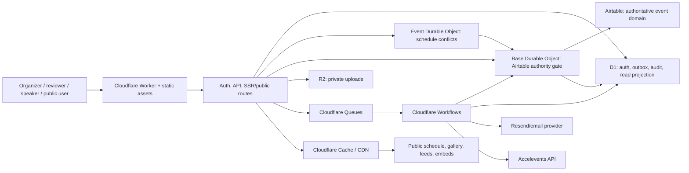

# Cloudflare/Airtable architecture

Status: current through Airtable schema v10 and D1 migration `0026_event_contact_identity_bindings.sql` at the 2026-08-12 release-candidate base. Provider and optional integration gates are called out explicitly below.

## Decision summary

Use a TypeScript monorepo deployed as one Cloudflare Worker with static assets and a Hono HTTP boundary. React/Vite powers the organizer, reviewer, speaker, and public clients. Airtable is the authoritative business-data store; D1 holds authentication/operational state and an indexed edge read projection; R2 stores private user files. A task-reminder Workflow and Queue consumers own implemented asynchronous work; additional provider exports/webhook consumers remain feature-gated.

This makes the Airtable bonus real while keeping public pages, dashboard queries, and conflict detection fast and reliable.

## Current runtime inventory

- One Worker/static-assets deployment per environment.
- `BaseAuthority`: per-environment/base SQLite Durable Object and the only Airtable writer.
- `AgendaCoordinator`: per-event SQLite Durable Object for schedule serialization.
- `TaskReminderWorkflow`: the configured Workflow binding.
- Active Queue consumers: email delivery and projection repair, each with an environment-specific dead-letter queue.
- Reserved producer bindings: webhook delivery and integration export; they are not production-complete provider claims.
- Two Cron triggers: daily bounded operational retention and hourly email queue-handoff recovery while email is enabled.
- Generated public API: 13 authenticated v1 paths plus `/openapi.json` and `/docs/api`.

## Logical components



## Repository layout target

```text
apps/web/                 React application and route modules
workers/app/              Worker entry, API, workflows, queue consumers
packages/domain/          Entities, value objects, policies, conflict logic
packages/contracts/       Zod/OpenAPI schemas and generated client
packages/data/            Airtable command store, D1 projection, repositories
packages/email/           Templates, merge engine, ICS generation
packages/integrations/    Accelevents and webhook adapters
packages/ui/              Shared accessible components and tokens
migrations/               D1 migrations
seed/                     Deterministic demo fixture and reset guard
tests/e2e/                Playwright judge paths
```

## Storage responsibilities

### Airtable: authoritative event domain

Stores events, configuration, forms/fields/rules, contacts, submissions/answers, participant links, rubrics/reviews, sessions, rooms/tracks, tasks/assignments, templates, resources, and integration mappings. It is deliberately visible/editable to the organizing team.

Constraints:

- Airtable Web API limit is 5 requests/second per base; every app read/write is routed through one Durable Object keyed by environment and base ID. That object owns one long-lived client, request limiter, 429 cooldown, and command store.
- Per-event Durable Objects may enforce event-local invariants, but they call the base authority object and never call Airtable directly.
- The personal access token is a server-only Wrangler secret. The base ID is non-secret environment configuration, but generated/owner-specific values stay in the ignored rendered config and never in public source.
- Writes include idempotency/source IDs so retries do not create duplicates.
- Multi-record commands use an operation record and compensating/reconciliation workflow; never pretend Airtable is transactional.

### D1: auth, operations, and fast projection

Stores users, memberships, sessions/magic links, API key hashes, webhook configs/deliveries, outbox/jobs, idempotency responses, audit events, provider delivery state, demo reset state, and normalized read models used by dashboard/agenda/public pages.

Protected browser requests lazily create one D1 Sessions API context with `DB.withSession("first-primary")`. Authentication, event lookup, active membership/contact relationships, and other identity-dependent authorization reads reuse that exact request-local `D1DatabaseSession`. Per the [D1 Sessions API](https://developers.cloudflare.com/d1/worker-api/d1-database/#withsession), the first query is served by the primary and later queries are sequentially consistent with the session bookmark, so a protected request cannot authenticate against one unconstrained database version and authorize against an older one. This is a primary-anchored sequential-consistency guarantee, not a multi-statement snapshot transaction. Anonymous public projection routes continue to use the ordinary binding and do not create a primary session.

Projection rules:

- A successful command durably records the Airtable result in the base authority object before attempting the atomic D1 projection/idempotency/audit/outbox batch.
- If D1 fails after Airtable succeeds, the repair state remains in the object that survived the failed D1 call. The response is committed-with-repair, and an object alarm retries D1 convergence without replaying Airtable.
- `BaseAuthority` implements webhook-cursor ingestion and bounded full-scan reconciliation for organizer edits. The current public config does not attach an Airtable webhook or a reconciliation Cron, so release operations must invoke and evidence reconciliation explicitly; a future trigger must use these same methods. Reconciliation compares canonical managed-content hashes, not only app-written source versions.
- D1 projection rows include `source_record_id`, `source_version`, `source_content_hash`, provider change cursor/time, and `projected_at`.

### R2: binary objects

- Private bucket; no public listing.
- Browser obtains a short-lived, one-time, key-specific capability PUT after authentication, tenant/event authorization, size/type allowlist, and quota reservation. The Worker streams directly to its private R2 binding, so the browser receives neither S3 credentials nor a public bucket URL.
- Finalize HEADs the immutable object, verifies R2 size, SHA-256 and tenant metadata, sniffs bounded magic bytes, and records detected type plus the exact R2 version and ETag.
- Private GET reauthorizes the current event relationship and streams only that recorded R2 version with attachment-only `Content-Disposition`, `nosniff`, CSP sandboxing, and private no-store caching.
- Disallow HTML/SVG execution, randomize storage keys, retain original display filename only as metadata.

### Cache API / CDN

- Public event pages/JSON feeds: browser `max-age=0, must-revalidate`, Cloudflare-only `max-age=60, stale-while-revalidate=300`, and a strong ETag. Do not combine `s-maxage` with `stale-while-revalidate`; current Cloudflare/RFC revalidation semantics make `s-maxage` disable stale serving.
- Public asset filenames content-hashed and immutable.
- Publish/mutation invalidates event cache by versioned cache key, not broad purge.
- Authenticated pages use `private, no-store`.

## Request/write flow

1. Worker parses and validates contract schema.
2. Session/API key resolves organization, event, role, and scopes.
3. Rate limit and CSRF/origin policy run.
4. Event Durable Object receives mutations that need event-local conflict serialization; other mutations proceed directly to the base authority object.
5. Command policy loads the minimal projection/source version and checks invariants.
6. The single SQLite-backed base authority Durable Object persists the command lease and request slot, rate-limits the Airtable command, then creates/updates authoritative records in batches.
7. The authoritative result is persisted in object storage before the atomic D1 projection, idempotency, audit, and outbox batch.
8. External side effects are woken after commit; D1 remains the durable drain source if a queue wake-up fails.
9. Response returns the canonical resource and either committed or committed-with-repair status. Replays return the original response.

Multi-record CFP draft and final writes first reserve a server-derived submission identity in D1. The reservation atomically enforces the published per-account limit and binds the user, semantic request hash, plan ID, and submission ID without storing an idempotency key or request body. The server evaluates the projected form and conditions, clears hidden answers, snapshots labels/types, and resolves track, reviewer group, provider links, versions, and audit identity without accepting routing metadata from the browser.

The compiled parent plan then runs inside the same base authority object. The object validates the four allowed table shapes, persists the complete request hash and ordered child ledger before provider I/O, and derives every child command ID from that hash. Links to newly created contacts and submissions are materialized only from earlier durable child results. An interruption can therefore resume the stored plan after object eviction without recompiling against a newer projection or issuing a second Airtable mutation, and the submission receipt is recorded only after every child projection is durable. Reusing a plan ID with different semantic content, supplying an unsupported field, or omitting final routing fails closed before a provider write.

Organizer submission reads are a separate authenticated projection surface. Every list, detail, and command request resolves the canonical event, reauthorizes `event:manage`, and scopes every D1 statement by organization and event. Lists use bounded, filter-bound keyset cursors over `(organization_id, event_id, updated_at, id)` indexes. Detail responses retain the submitted form version and answer label/type/order snapshot, redact file answers, omit provider IDs and object keys, and report projection freshness or pending repair explicitly.

Lifecycle changes and notes use one versioned command envelope. A D1 receipt durably freezes stable BaseAuthority subcommands before provider I/O. Lifecycle changes update the authoritative submission; notes first version-touch that submission and then create a linked authoritative note. Exact retries resume the same subcommands after eviction or an unknown outcome, while changed command reuse, stale versions, illegal transitions, permission failures, and cross-event targets fail closed. BaseAuthority remains the only Airtable writer and supplies the projection, audit, outbox, and repair behavior.

## Background execution

### Cloudflare Workflows

`TaskReminderWorkflow` is the configured runtime Workflow. It freezes a bounded reminder plan, waits until the reminder time, re-queries incomplete assignments, and hands eligible delivery intents to the durable email path with stable identities and skipped reasons.

Decision orchestration, calendar invitation changes, projection reconciliation, and demo reset use their implemented D1/Durable Object/Queue boundaries rather than pretending that undeployed Workflow classes exist. A future Accelevents Workflow remains gated on credentialed contract proof. Any additional Workflow must be added to `workers/app/wrangler.jsonc`, generated bindings, tests, provisioning inventory, and recovery docs in the same change.

### Queues

- `email-send`: provider delivery fan-out and bounded retries.
- `projection-repair`: commands that committed in Airtable but missed D1.
- `webhook-delivery`: reserved producer binding; consumer remains gated.
- `integration-export`: reserved producer binding; consumer remains gated on Accelevents proof.

Every message has deterministic ID and dedupe record in D1.

## Authentication and authorization

- Organizer/reviewer: emailed one-time magic link → short-lived exchange → `HttpOnly`, `Secure`, `SameSite=Lax` session cookie; rotate session on privilege changes.
- CFP applicant: after IP/event abuse limits and a valid Turnstile challenge, an active projected CFP may create a D1-only unprivileged identity and send the same browser-bound magic link. Identity creation grants no organization/event membership; draft and submit routes still require session, origin, CSRF, and server-resolved CFP policy.
- Speaker: event-scoped portal invitation/magic link with explicit expiry and one-time exchange. The initial acceptance capability may cross into a clean/incognito browser; self-service recovery links remain bound to the requesting browser. A queued replacement transactionally supersedes the prior `portal_grants` row, and command-triggered issuance has a stable versioned delivery/idempotency identity.
- Portal bootstrap: the URL slug resolves server-side to exactly one ready tenant and non-deleted event. A generic authenticated cookie is never sufficient: every request joins the active user email to the exact projected contact/event speaker relationship before and after reading that speaker's tasks and session assignments. Responses expose stable product IDs and a bounded read model, never provider record IDs or private object keys.
- API: opaque random token shown once; store salted hash, prefix, scopes, event/org, created/last-used/revoked.
- Roles: owner, organizer, reviewer, viewer. Speaker authorization is relationship-based.
- Every query filters organization/event before entity ID; cross-tenant test matrix is mandatory.
- Mutations enforce CSRF token or strict same-origin JSON policy; public form uses Turnstile and layered rate limits.

## Scheduling concurrency

One event Durable Object serializes schedule writes. Client sends schedule version/ETag. The object revalidates overlaps against the latest D1 projection, delegates the authoritative write to the base authority object, advances the projection version, and broadcasts invalidation. This prevents two organizers from simultaneously creating a conflict while the base-level object enforces Airtable's shared limit.

## Conflict algorithm

Treat intervals as half-open `[start, end)`, so adjacent sessions are not conflicts. For candidate placement:

1. Query same event/day for intervals intersecting `candidate.start < other.end AND candidate.end > other.start`.
2. Hard conflict when room IDs match.
3. Hard conflict when participant sets intersect for speaker/moderator/chair roles.
4. Soft warning when transition buffer/capacity/readiness rules fail.
5. Return structured conflicts with code, related session/entity, and overlap.

Property tests cover symmetry, adjacency, containment, timezone/DST boundaries, multi-session participants, and concurrent version failure.

## Email and calendar architecture

Use Resend initially because arbitrary transactional delivery, attachments, domain verification, and webhooks are clearer than relying on Cloudflare Email Routing. Cloudflare still owns scheduling/orchestration. The provider is behind an adapter.

ICS rules:

- stable UID: `session-{sessionId}@{verified-domain}`;
- `DTSTAMP`, UTC `DTSTART/DTEND`, `ORGANIZER`, `ATTENDEE`, `LOCATION`, escaped description;
- `METHOD:REQUEST`, `STATUS:CONFIRMED`, `SEQUENCE` increments on material changes;
- cancellation uses same UID with `METHOD:CANCEL`/`STATUS:CANCELLED`;
- deterministic snapshot tests and external validator fixture.

## Observability

- Structured safe JSON events in a per-environment Analytics Engine dataset with request/job/delivery IDs, route template, event ID, duration, and outcome; no tokens, bodies, raw paths, queries, or private URLs.
- Persisted Workers Logs and automatic traces remain disabled because Cloudflare attaches request metadata to their platform envelope. Real-time tail is authorized, ephemeral debugging only and must use synthetic credential-free routes.
- Analytics Engine provides aggregate operational telemetry but may adaptively sample; the D1 audit/operational event sink introduced with the projection/outbox work remains the deterministic correlation source.
- Metrics: request latency/error, cache hit, Airtable latency/429, projection lag, queue age/retries, workflow failures, email delivery/bounce, export failures, conflict-save rejection.
- Sentry or equivalent redacted error reporting remains behind an environment flag; built-in Cloudflare Worker request/error/CPU/wall-time metrics are the platform baseline.
- `/health/live` checks Worker; `/health/ready` verifies configured bindings without leaking details.
- Synthetic smoke submits against dedicated synthetic event or read-only demo path; never pollutes judge data.

## Security posture

- Content Security Policy, frame controls, Referrer-Policy, HSTS, Permissions-Policy.
- Sanitize rich text on write and render; allowlist iframe hosts only when explicitly enabled.
- Validate uploads by declared and detected content type; enforce image/file size and extension policy.
- Constant-time secret comparisons; rotate/revoke all provider tokens.
- Separate preview/production Airtable bases and R2 buckets.
- Audit privileged changes and message sends with safe diffs.
- Export/delete user data by email for basic privacy operations.

## Deployment environments

- `local`: Miniflare/local D1, memory/fixture Airtable adapter, local R2; email sink.
- `preview`: isolated Cloudflare resources and Airtable test base; deploy per branch when practical.
- `production`: named Worker/custom domain, production Airtable base, private R2, queues/workflows, Resend domain.

`wrangler.jsonc` contains binding names but never generated IDs until provisioned. Resource IDs and secrets are captured in the external setup checklist, not guessed.

## Architecture risks and mitigations

| Risk | Mitigation |
|---|---|
| Airtable latency/rate limit | One base authority Durable Object, batching, D1 reads, cache, `Retry-After`, reconciliation. |
| Dual-store divergence | Authority boundary, source versions, outbox, repair workflow, projection-lag metric. |
| Deadline complexity | Ports/adapters, one Worker, fixed dashboard, single review round, seeded vertical slice first. |
| Duplicate external effects | Idempotency keys and D1 delivery/export mappings. |
| Drag/drop accessibility | Equivalent keyboard/dialog editor and server API. |
| File abuse | Turnstile, quotas, signed intent, type/size validation, private bucket. |
| Calendar client variance | Standards-compliant ICS fixtures tested in Google/Outlook/Apple before ship. |
| Accelevents doc gaps | Credentialed sandbox spike; fixture adapter never represented as production proof. |
