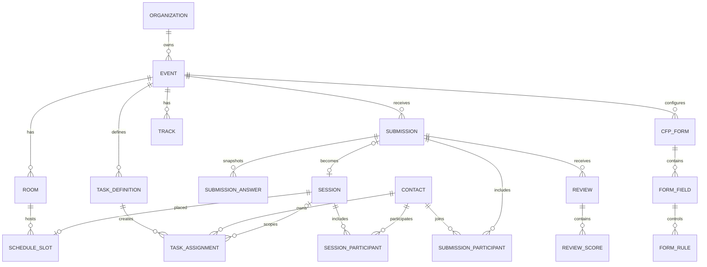

# Data model and persistence map

## Modeling conventions

- Internal IDs are sortable UUIDs/ULIDs; Airtable record IDs are stored separately.
- All tenant-owned records carry `organization_id`; event records also carry `event_id`.
- Timestamps are UTC ISO 8601. Events carry an IANA timezone.
- Mutable records carry `version` and `updated_at` for optimistic concurrency.
- User-visible deletes are soft where recovery matters; immutable audit/delivery records are append-only.
- External IDs are namespaced by provider and never inferred from titles.

## Core relationships

## Airtable authoritative tables

### Organizations

`ID, Name, Slug, Default timezone, Created at`

### Events

`ID, Organization, Name, Slug, Timezone, Start, End, Venue, CFP open/close, Status, Brand JSON, Published version, Created/updated`

### Forms

`ID, Event, Name, Status, Version, Welcome content, Submission limit, Edit-after-close flag, Published at`

### Form Fields

`ID, Form, Stable key, Order, Block type, Label, Help, Required, Options JSON, Validation JSON`

### Form Rules

`ID, Form, Target field, Effect(show/require), Source field, Operator, Value JSON, Order`

### Contacts

`ID, Organization, Email normalized, Display name, First/last, Pronouns, Title, Company, Bio, Headshot object key, Social JSON, Created/updated`

Contact uniqueness is organization + normalized email. Event membership is modeled separately so reusable profiles do not leak event-specific status.

### Event Contacts

`ID, Event, Contact, Roles, Portal state, Invitation time, Last active, Readiness projection`

### Submissions

`ID, Event, Form, Form version, Friendly ID, Submitter contact, Title, Track, Status, Route key, Draft JSON, Default reviewer group ID, Submitted at, Decision note, Source version`

### Submission Answers

`ID, Submission, Field stable key, Field label snapshot, Type, Value JSON, Order`

### Submission Participants

`ID, Submission, Contact, Role, Order, Is primary`

### Rubrics / Criteria

Rubrics: `ID, Event, Name, Status`  
Criteria: `ID, Rubric, Label, Guidance, Min, Max, Weight, Order`

### Reviews / Review Scores

Review: `ID, Submission, Reviewer membership, Status, Conflict flag/note, Submitted at`  
Score: `ID, Review, Criterion, Numeric score, Comment`

### Sessions

`ID, Event, Source submission, Friendly ID, Title, Abstract, Status, Track, Format, Expected attendance, Duration, Public flag, External mapping JSON, Updated at`

### Session Participants

`ID, Session, Contact, Role, Order, Confirmed state`

### Rooms / Tracks / Formats

Room: `ID, Event, Name, Capacity, Sort order`  
Track: `ID, Event, Name, Color, Description, Sort order, CFP selection, CFP aliases JSON, Route key, Submission track, Default reviewer group ID`
Format: `ID, Event, Name, Default duration, Sort order`

### Schedule Slots

`ID, Event, Session, Start UTC, End UTC, Room, Version, Published version, Override reason`

### Task Definitions

`ID, Event, Name, Type(link/form/file/ack), Description, Required default, Approval required, Target rule JSON, Form schema JSON, File policy JSON`

### Task Assignments

`ID, Event, Definition, Contact, Optional session, Due UTC, Required, Status, Completed at, Approved at/by, Response JSON, File object IDs`

### Resources

`ID, Event, Title, Subtitle, Sanitized HTML, Target rule JSON, Status, Published at`

### Email Templates

`ID, Event, Name, Audience type, Sender name/email, Subject, Body document JSON, generated HTML/plain text, Reply-to, used merge fields JSON, Merge schema version, Status, Version`

### Campaigns / Messages

Campaign: `ID, Event, Template/version and exact snapshot, Audience/filter snapshot, Trigger, Scheduled at, Status`

Message: `ID, Campaign, Contact/email, Idempotency key, Provider ID, Status timestamps, Error code`

### Integrations / Sync Runs / External Mappings

Integration: `ID, Event, Provider, Enabled, Non-secret config JSON`  
Mapping: `ID, Integration, Entity type, Source ID, External ID, Content hash, Last synced`  
Run: `ID, Integration, Trigger, Mode, Cursor, Counts, Status, Started/finished, Error summary`

## D1 operational tables

### Identity and access

- `users`
- `organization_memberships`
- `event_memberships`
- `auth_sessions`
- `magic_link_tokens`
- `portal_grants`
- `api_keys`

Token tables store hashes, prefix, expiry/use/revoke timestamps, never plaintext.

`portal_grants` is operational authorization evidence, not a second copy of the speaker business domain. A grant binds one hashed magic-link capability to an organization, event, and contact; active uniqueness, expiry, consumption, revocation, supersession, and audit rows enforce the one-time lifecycle. The current `p_event_contacts` relationship remains the authority gate at exchange and on every portal bootstrap, so deleting or revoking the Airtable-owned relationship fails closed immediately.

### Delivery and consistency

- `idempotency_keys`
- `cfp_submission_reservations`
- `outbox_events`
- `workflow_runs`
- `provider_messages`
- `webhook_endpoints`
- `webhook_deliveries`
- `integration_runs`
- `external_mappings`
- `projection_watermarks`
- `audit_events`

### Read projection

Normalized tables mirror only query-critical fields:

- `p_events`
- `p_forms`, `p_form_fields`, `p_form_rules`
- `p_contacts`, `p_event_contacts`
- `p_submissions`, `p_submission_participants`
- `p_reviews`, `p_review_scores`
- `p_sessions`, `p_session_participants`
- `p_rooms`, `p_tracks`, `p_schedule_slots`
- `p_task_definitions`, `p_task_assignments`
- `p_resources`

Every projection row has `source_record_id`, `source_version`, `projected_at`.

`cfp_submission_reservations` contains only organization/event/user IDs, the server-derived submission and plan IDs, and a semantic request hash. Its atomic insert is the per-account submission-limit gate; raw idempotency keys and proposal bodies are never stored there.

## Required indexes

- contacts: `(organization_id, email_normalized)` unique.
- event membership: `(event_id, contact_id)` unique.
- submissions: `(event_id, status, submitted_at)`, `(event_id, track_id, status)`.
- reviewer queue: `(reviewer_id, status, updated_at)`.
- sessions: `(event_id, status)`, `(event_id, track_id)`.
- schedule: `(event_id, start_at, end_at)`, `(event_id, room_id, start_at)`.
- participants: `(session_id, contact_id)` and `(contact_id, session_id)`.
- assignments: `(event_id, contact_id, status, due_at)`, `(event_id, required, status, due_at)`.
- outbox: `(status, available_at)`.
- audit: `(event_id, created_at)`, `(entity_type, entity_id, created_at)`.

## Derived metrics

- `speaker_required_total` = required assignments applicable to contact/session.
- `speaker_required_complete` = completed (and approved when required).
- `speaker_ready` = total > 0 and total == complete; policy may treat zero assigned tasks as not configured, not ready.
- `next_due` = earliest incomplete required due date.
- `overdue_count` = incomplete required with due < now in event timezone semantics.
- `review_weighted_score` = sum(score × weight)/sum(applicable weights), never zero-fill missing criteria.
- `blocking_conflict_count` = distinct hard conflict pairs.

## Seed dataset

Deterministic demo event “AI Engineer Summit 2026” includes:

- two days, three rooms, four tracks, three formats;
- one published conditional CFP;
- at least 12 submissions across all statuses;
- three reviewers and a completed/incomplete review mix;
- six accepted sessions, two unscheduled, one intentional speaker conflict;
- eight speakers with ready, outstanding, and overdue task states;
- headshots/slides fixtures with safe licenses/placeholders;
- templates for receipt, acceptance, decline, task reminder, schedule update;
- public schedule and speaker gallery;
- fixture Accelevents adapter mapping and one failed/retryable sync run.

Reset is permitted only when event flag `is_demo = true` and supplied reset phrase matches. Production seed contains no real recipient email by default.
